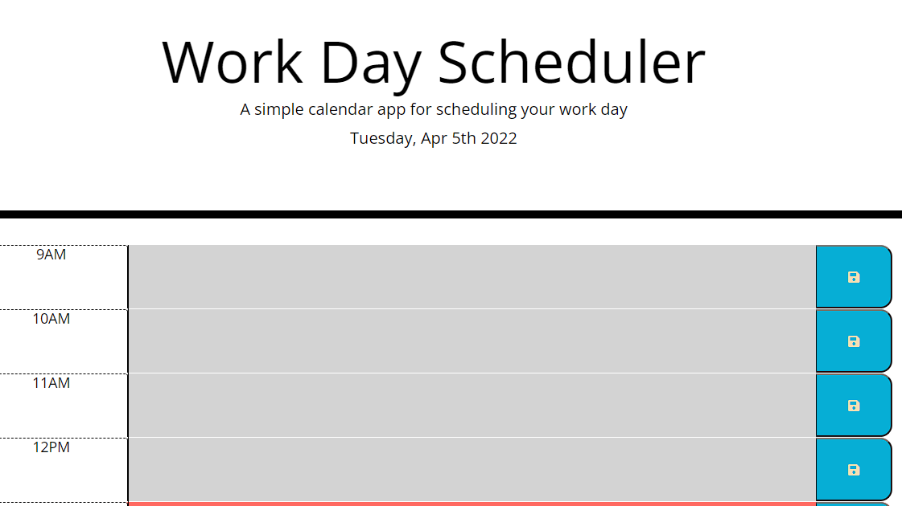

# Work Day Scheduler 
Schedule your day by the hour.  Current hour will be displayed in red, past hours will be shaded grey, and future time slots will be shaded green.

## Purpose
This was made with the intention of getting more comfortable with jquery and moment.js.

## Made with 
* HTMl
* CSS/Bootstrap
* Javascript/Jquery/Moment.js

## Link to Page
https://arankin7.github.io/daily-scheduler/

## Images

### Made by
Starter code provided by Rutgers Bootcamp
Javascript and some custom CSS by Anthony Rankin
